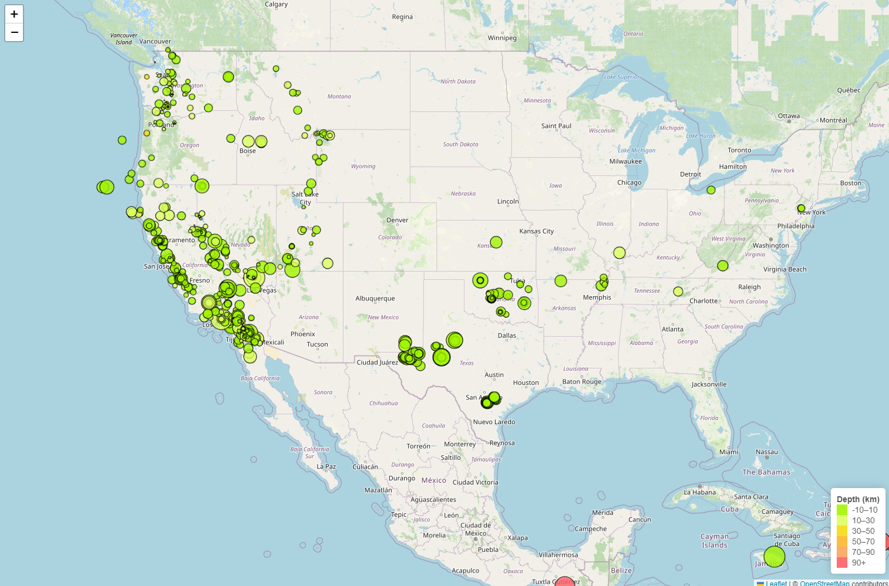

# leaflet-challenge

# Part 1
# Earthquake Visualization with Leaflet

This project is an interactive map visualization of earthquake data using Leaflet.js. The map displays earthquake locations based on latitude and longitude, with marker sizes representing the magnitude of the earthquake and marker colors representing the depth.

## Project Overview

The goal of this exercise was to visualize earthquake data from the USGS using Leaflet.js. The map dynamically plots all recorded earthquakes over a selected period, providing users with an intuitive way to explore the data.

## Steps Taken to Complete the Exercise

1. **HTML Setup**:
    - Started with a basic HTML file (`index.html`) that links to the necessary Leaflet and D3.js libraries through CDNs.
    - Added a `div` element with the id `map` to serve as the container for the Leaflet map.

2. **CSS Styling**:
    - Created a `style.css` file to handle the layout and appearance of the map and legend.
    - Ensured the map covers the full height of the viewport and styled the legend to match the desired output, including rounded corners, shadow effects, and padding for readability.

3. **JavaScript Logic**:
    - Implemented `logic.js` to handle the main functionality:
        - **Map Initialization**: Used Leaflet to initialize the map, centering it over the United States.
        - **Data Fetching**: Fetched earthquake data from the USGS GeoJSON feed for the past week using D3.js.
        - **Marker Creation**: Created circle markers for each earthquake, with the size of the markers based on the earthquake's magnitude and the color based on depth.
        - **Popup Information**: Added popups to each marker to display detailed information, including location, magnitude, depth, and time of occurrence.
        - **Legend**: Added a color-coded legend to the map to provide context for the earthquake depths, matching the visual style of the sample provided.

4. **Testing and Refinements**:
    - Adjusted the color gradient and sizing of the markers to ensure they visually represent the earthquake data as intended.
    - Refined the legend to closely match the example image provided, using specific colors and labels to indicate depth ranges.

## How to Run

1. Clone the repository or download the project files.
2. Ensure you have an active internet connection to load external libraries via CDN.
3. Open `index.html` in a web browser to view the interactive map.

## Customization Options

- **Data Source**: Change the URL in the `d3.json` call in `logic.js` to visualize different earthquake datasets from the USGS.
- **Marker Styles**: Adjust the `getColor` and `getRadius` functions in `logic.js` to modify the color and size of the markers.
- **Legend and Styling**: Update `style.css` to customize the map’s appearance, including the legend and overall layout.

## Example Output

An example of the expected output is shown below:

## Tools and Technologies

- **[Leaflet.js](https://leafletjs.com/)**: An open-source library for interactive maps.
- **[D3.js](https://d3js.org/)**: A JavaScript library for creating dynamic data visualizations.
- **HTML/CSS/JavaScript**: Core web technologies for creating and styling the map.

## Code Source
- Learning Assistant
- GitHub location: https://github.com/jeffjunohkim/belly-button-challenge.git
  